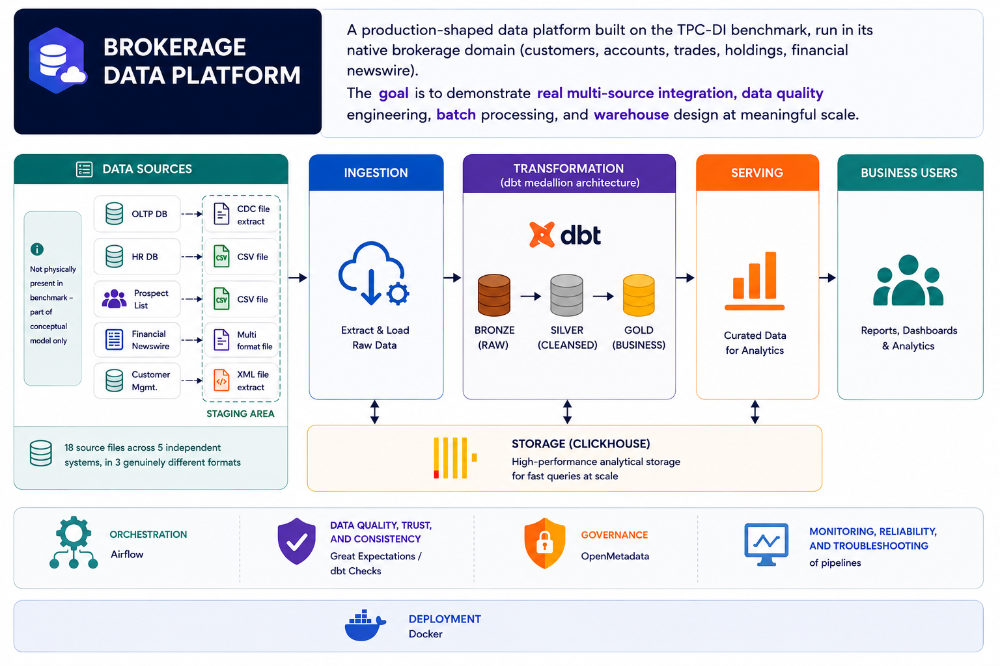

# Brokerage Data Platform

## Status: 🚧 In Progress — Phase 0 of 9

## What this is
A production-shaped data platform built on the TPC-DI benchmark, run in its
native brokerage domain (customers, accounts, trades, holdings, financial
newswire).
The **goal** is to demonstrate **real multi-source integration**, **data quality**
engineering, **batch** processing, and **warehouse** design
at meaningful scale.

## Why TPC-DI
TPC-DI is the only widely-used benchmark purpose-built to simulate real
data integration pain: **18 source files** across **5 independent systems** that these five systems know **nothing** about each other, in
**3 genuinely different formats** (CSV, XML, fixed-width-no-delimiter), with
documented real **data quality problems** rather than synthetic mess injected after the fact.
It also scales to real "**big data**" volume (1GB → 2TB+ via scale factor) and
ships with an **incremental/streaming** variant.

## Business Framing
This project stays in TPC-DI's native domain — a brokerage firm managing
customer accounts, trades, holdings, and market data. The operational story mirrors real
brokerage pain points:
- **Trade & settlement visibility** — can operations confirm a trade
  processed correctly across the trade, cash, and holding tables it
  touches, without manual reconciliation?
- **Customer & account trust** — CRM updates arrive as mixed record types
  (new account, updated account, customer-only update) in the same file;
  can the platform resolve these correctly and keep an auditable history?
- **Market & financial data reliability** — FINWIRE's commingled company,
  security, and financial records feed valuation and reporting; a parsing
  error here has direct downstream impact on numbers stakeholders trust.
- **Timely reporting** — moving from a single quarterly historical load
  toward genuine daily delivery (Augmented Incremental) reflects the real
  shift from batch-only reporting to near-real-time operational visibility.

## Architecture

## Data Sources

This overview is a high-level summary of the 18 source files, grouped by the five independent systems they originate from. For a full file-by-file dictionary, see [docs/datasources.md](./docs/datasources.md).

1. Human Resources (HR) 
    - `HR.csv` (7): Employee master list, salaries, and reporting structures.
2. Marketing & Client Relationship Management (CRM)
    - `Prospect.csv` (8): Third-party prospect list for marketing campaigns.
    - `CustomerMgmt.xml` (9): New and updated customer and account actions.
    - `WatchHistory.txt` (15): User behavior data (which stocks customers are actively watching on the app).
3. Brokerage & Trading Operations
    - `Trade.txt` (11): Core trade transaction fact table.
    - `TradeHistory.txt` (12): Status-change history per trade.
    - `HoldingHistory.txt` (13): Snapshot of security holdings resulting from trades.
    - `TradeType.txt` (6) & `StatusType.txt` (3): System lookup codes defining trade behaviors and execution states.
4. Finance, Treasury & Market Research
    - `CashTransaction.txt` (14): Cash movement resulting from trades or account activities.
    - `TaxRate.txt` (4): Tax jurisdictions applied to investment gains.
    - `DailyMarket.txt` (16): Daily security price and volume snapshot for market data.
    - `FINWIRE` (10): Financial newswire providing company, security, and financial records.
    - `Industry.txt` (5): Business sector categorizations used to classify companies.
5. IT, Data Platform & Audit (Enterprise Shared Services)
    - `Date.txt` (1) & `Time.txt` (2): Core date and time dimensions for fact table joins.
    - `BatchDate.txt` (17): Control file marking the "as-of" date for the current batch.
    - `*_audit.csv` (18): Auto-generated per-table row counts and control totals for load validation.

## How to Run This
[Not written yet — will document once Phase 2 is stable and repeatable.]

## Documentation
- Architecture Decision Records (`./docs/adr/`)
- Data Dictionary (`./docs/data-dictionary.md`)
- Data Quality Report (`./docs/dq-report.md`)
- Runbook (`./docs/runbook.md`)
- Case Study (`./docs/case-study.md`)
- Incident Notes (`./docs/incident-notes.md`)

## Tech Stack