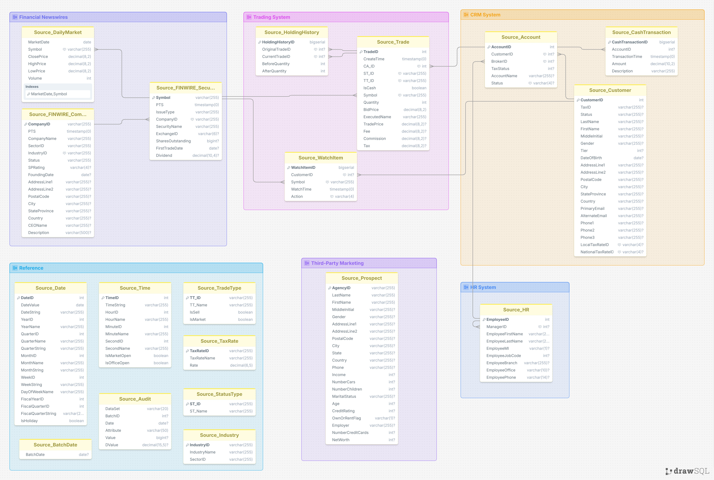

# Source Data Dictionary — sources.md
## brokerage-data-platform

Grounded directly against TPC Benchmark™ DI Standard Specification, Revision
1.1.0 (sections 2.2.2.x). Where a file's exact layout was **not** present in
the spec excerpt available, this is marked explicitly — those entries carry
forward from a previously verified real sample, not from the spec text
itself.


.

## Batch Scope Matrix

| File | Batch1 (Historical) | Batch2/3 (Incremental) | CDC fields present? |
|---|---|---|---|
| CustomerMgmt.xml | ✅ | ❌ (replaced by flat files) | N/A (XML ActionType instead) |
| Account.txt | ❌ | ✅ | Yes |
| Customer.txt | ❌ | ✅ | Yes |
| HR.csv | ✅ | ❌ | No |
| Prospect.csv | ✅ | ✅ (full re-extract each batch) | No |
| FINWIRE (quarterly) | ✅ | ❌ | No |
| Trade.txt | ✅ | ✅ | **No in Batch1, Yes in Batch2/3** |
| TradeHistory.txt | ✅ | ❌ (Historical Load only, per spec) | No |
| HoldingHistory.txt | ✅ | ✅ | **No in Batch1, Yes in Batch2/3** |
| CashTransaction.txt | ✅ | ✅ | Not verified in this excerpt |
| WatchHistory.txt | ✅ | ✅ | **No in Batch1, Yes in Batch2/3** |
| DailyMarket.txt | ✅ | ✅ | **No in Batch1, Yes in Batch2/3** |
| Date.txt / Time.txt / StatusType.txt / TaxRate.txt / Industry.txt / TradeType.txt | ✅ | ❌ | No |
| BatchDate.txt | ✅ | ✅ | N/A (control file) |
| `*_audit.csv` | ✅ | ✅ | N/A |

**The pattern to internalize:** several files (Trade, HoldingHistory,
WatchHistory, DailyMarket) are **not single fixed schemas** — they have
fewer columns in Batch1 than in Batch2/3, because the spec states plainly
for each of them: *"The CDC_FLAG and CDC_DSN fields are not present in the
data set used by the Historical Load."* Your ingestion logic needs two
branches per file, not one.


## 1. CustomerMgmt.xml
**Format:** Nested XML \
**Scope:** Batch1 (Historical) only\
**Structure**, per the actual XSD in the spec:

An `Action` element wraps each event, with attributes `ActionType` and
`ActionTS` (dateTime). Inside, a `Customer` element carries attributes
`C_ID` (required), `C_TAX_ID`, `C_GNDR`, `C_TIER`, `C_DOB`, and contains:
- A `TaxInfo` block (optional): `C_LCL_TX_ID`, `C_NAT_TX_ID`
- Zero or more `Account` elements, each with attribute `CA_ID` (required)
  and `CA_TAX_ST`, plus child elements `CA_B_ID` and `CA_NAME`

**Row example** (constructed to match the actual XSD structure shown):
```xml
<Action ActionType="NEW" ActionTS="2015-03-03T08:47:33">
  <Customer C_ID="1500000" C_TAX_ID="123-45-6789" C_GNDR="M" C_TIER="2" C_DOB="1975-06-01">
    <TaxInfo>
      <C_LCL_TX_ID>US1</C_LCL_TX_ID>
      <C_NAT_TX_ID>US2</C_NAT_TX_ID>
    </TaxInfo>
    <Account CA_ID="5000001" CA_TAX_ST="1">
      <CA_B_ID>1284</CA_B_ID>
      <CA_NAME>Growth Account</CA_NAME>
    </Account>
  </Customer>
</Action>
```


## 2. Account.txt
**Format:** Pipe-delimited\
**Scope:** Batch2/Batch3 (Incremental) only\


| Column | Description |
|---|---|
| CDC_FLAG | `I` / `U` |
| CDC_DSN | Sequence number |
| CA_ID | Account ID |
| CA_B_ID | Managing broker ID |
| CA_C_ID | Owning customer ID |
| CA_NAME | Account name |
| CA_TAX_ST | Tax status code |
| CA_ST_ID | Status code |

**Row example (verified real sample):**
`I|8214563|20469|1284|10284|WSrAJPnvZzbENxGPc...|0|ACTV`


## 3. Customer.txt

**Format:** Pipe-delimited  
**Scope:** Batch2/Batch3 (Incremental) only

The incremental Customer extract contains CDC metadata followed by the
complete customer record. Unlike `CustomerMgmt.xml`, each phone number is
flattened into four separate fields (country code, area code, local number,
extension).

| Column | Description |
|--------|-------------|
| CDC_FLAG | CDC operation (`I` = Insert, `U` = Update) |
| CDC_DSN | CDC sequence number |
| C_ID | Customer identifier |
| C_TAX_ID | Government tax identifier |
| C_ST_ID | Customer status code |
| C_L_NAME | Last name |
| C_F_NAME | First name |
| C_M_NAME | Middle name |
| C_GNDR | Gender |
| C_TIER | Customer tier |
| C_DOB | Date of birth |
| C_ADLINE1 | Address line 1 |
| C_ADLINE2 | Address line 2 |
| C_ZIPCODE | Postal code |
| C_CITY | City |
| C_STATE_PROV | State / Province |
| C_CTRY | Country |
| C_CTRY_1 | Phone 1 country code |
| C_AREA_1 | Phone 1 area code |
| C_LOCAL_1 | Phone 1 local number |
| C_EXT_1 | Phone 1 extension |
| C_CTRY_2 | Phone 2 country code |
| C_AREA_2 | Phone 2 area code |
| C_LOCAL_2 | Phone 2 local number |
| C_EXT_2 | Phone 2 extension |
| C_CTRY_3 | Phone 3 country code |
| C_AREA_3 | Phone 3 area code |
| C_LOCAL_3 | Phone 3 local number |
| C_EXT_3 | Phone 3 extension |
| C_PRIM_EMAIL | Primary email address |
| C_ALT_EMAIL | Alternate email address |
| C_LCL_TX_ID | Local tax jurisdiction |
| C_NAT_TX_ID | National tax jurisdiction |

**Row example (verified Batch3 sample):**

```text
I|6455|4739|016-32-5107|ACTV|Moncur|Vittorio||M|3|1983-06-21|19452 Bryant Irvin West||H2E 1V8|Paterson|TX|United States of America|||821-2946||||205-8612|06614|1|968|027-5679||Vittorio.Moncur@farce.de||MD4|MT5
```


## 4. HR.csv 
**Format:** Comma-delimited\
**Scope:** Batch1 (Historical) only, ordered by EmployeeID\

| Column | Type | Description |
|---|---|---|
| EmployeeID | IDENT_T | ID of employee (Not NULL) |
| ManagerID | IDENT_T | ID of employee's manager (Not NULL) |
| EmployeeFirstName | CHAR(30) | First name (Not NULL) |
| EmployeeLastName | CHAR(30) | Last name (Not NULL) |
| EmployeeMI | CHAR(1) | Middle initial |
| EmployeeJobCode | NUM(3) | Numeric job code |
| EmployeeBranch | CHAR(30) | Facility/branch |
| EmployeeOffice | CHAR(10) | Office number/description |
| EmployeePhone | CHAR(14) | Phone number |

**Row example**:
`140501,140102,John,Smith,R,314,Chicago Branch,7B,(312) 555-0142`


## 5. Prospect.csv 
**Format:** Comma-delimited\
**Scope:** Batch1 & Batch2/3 (full re-extract every batch — no CDC, per
earlier documented behavior of this source)

| Column | Type | Restriction | Description |
|---|---|---|---|
| AgencyID | CHAR(30) | Not NULL | Unique agency identifier |
| LastName | CHAR(30) | Not NULL | Last name |
| FirstName | CHAR(30) | Not NULL | First name |
| MiddleInitial | CHAR(1) | | Middle initial |
| Gender | CHAR(1) | M/F/U | |
| AddressLine1 | CHAR(80) | | |
| AddressLine2 | CHAR(80) | | |
| PostalCode | CHAR(12) | | |
| City | CHAR(25) | Not NULL | |
| State | CHAR(20) | Not NULL | |
| Country | CHAR(24) | | |
| Phone | CHAR(30) | | |
| Income | NUM(9) | | Annual income |
| NumberCars | NUM(2) | | |
| NumberChildren | NUM(2) | | |
| MaritalStatus | CHAR(1) | S/M/D/W/U | |
| Age | NUM(3) | | |
| CreditRating | NUM(4) | | |
| OwnOrRentFlag | CHAR(1) | O/R/U | **corrected from "OwnHome"** |
| Employer | CHAR(30) | | |
| NumberCreditCards | NUM(2) | | **corrected from "CreditCard"** |
| NetWorth | NUM(12) | | |

**Row example:**
`PEL0,PELLAND,Netti,,F,21847 Olympia Street,,T6B 1I1,Fairbanks,MA,United States of America,1-712-522-6088,368776,,3,W,20,760,O,Brink's,,1058868`


## 6. FINWIRE 
**Format:** Fixed-width, no delimiters, quarterly files (`FINWIRE2015Q4`, etc.)\
**Scope:** Batch1 only. All 3 record types share a 15-char PTS + 3-char
RecType prefix at the start of every record.

### CMP records (company)
| Field | Width | Description |
|---|---|---|
| PTS | 15 | Posting timestamp, `YYYYMMDD-HHMMSS` |
| RecType | 3 | `"CMP"` |
| CompanyName | 60 | |
| CIK | 10 | SEC identifier |
| Status | 4 | `ACTV` / `INAC` |
| IndustryID | 2 | |
| SPrating | 4 | |
| FoundingDate | 8 | `YYYYMMDD` |
| AddrLine1 | 80 | |
| AddrLine2 | 80 | |
| PostalCode | 12 | |
| City | 25 | |
| StateProvince | 20 | |
| Country | 24 | |
| CEOname | 46 | |
| Description | 150 | |

### SEC records (security)
| Field | Width | Description |
|---|---|---|
| PTS | 15 | |
| RecType | 3 | `"SEC"` |
| Symbol | 15 | |
| IssueType | 6 | |
| Status | 4 | |
| Name | 70 | |
| ExID | 6 | Exchange ID |
| ShOut | 13 | Shares outstanding |
| FirstTradeDate | 8 | |
| FirstTradeExchg | 8 | |
| Dividend | 12 | |
| CoNameOrCIK | 60 or 10 | Company name (if not all-digits) or CIK (if all-digits) |

### FIN records (quarterly financials)
| Field | Width | Description |
|---|---|---|
| PTS | 15 | |
| RecType | 3 | `"FIN"` |
| Year | 4 | |
| Quarter | 1 | `1`–`4` |
| QtrStartDate | 8 | |
| PostingDate | 8 | |
| Revenue | 17 | |
| Earnings | 17 | |
| EPS | 12 | Basic EPS |
| DilutedEPS | 12 | |
| Margin | 12 | |
| Inventory | 17 | |
| Assets | 17 | |
| Liabilities | 17 | |
| ShOut | 13 | |
| DilutedShOut | 13 | |
| CoNameOrCIK | 60 or 10 | |

**Note:** all fields are space-padded — text left-justified, numeric
right-justified; CIK values are zero-padded on the left.


## 7. Trade.txt
**Format:** Pipe-delimited\
**Scope:** Batch1 (Historical, **no CDC fields**) and Batch2/3 (Incremental,
**with CDC fields**) — these are genuinely different column counts, per
spec: *"The CDC_FLAG and CDC_DSN fields are not present in the data set
used by the Historical Load."*

### Historical Load (Batch1) — 14 fields, no CDC
| Column | Description |
|---|---|
| T_ID | Trade identifier |
| T_DTS | Trade timestamp |
| T_ST_ID | Status type |
| T_TT_ID | Trade type |
| T_IS_CASH | `0` margin / `1` cash |
| T_S_SYMB | Security symbol |
| T_QTY | Quantity (> 0) |
| T_BID_PRICE | Requested unit price |
| T_CA_ID | Account ID |
| T_EXEC_NAME | Name of person executing the trade |
| T_TRADE_PRICE | Settled price (null unless status = CMPT) |
| T_CHRG | Fee charged |
| T_COMM | Commission |
| T_TAX | Tax due |

**Row example (real, Historical Load):**
`0|2012-07-07 00:02:34|CMPT|TMB|0|AAAAAAAAAAAACQP|2939|9.57|0|3160|10.02|58.95|27.31|1611.19`

### Incremental (Batch2/3) — 16 fields, with CDC
Same 14 fields as above, prefixed with `CDC_FLAG` (`I`/`U`) and `CDC_DSN`.


## 8. TradeHistory.txt
**Format:** Pipe-delimited\
**Scope:** **Historical Load (Batch1) only** — per spec: *"This file is
used only in the Historical Load."* There is no Batch2/3 version.

| Column | Description |
|---|---|
| TH_T_ID | Trade ID (corresponds to Trade.txt's T_ID) |
| TH_DTS | Timestamp of this status update |
| TH_ST_ID | Status type at this point in the trade lifecycle |

**Row example:**
`0|2012-07-07 00:01:13|SBMT`


## 9. HoldingHistory.txt
**Format:** Pipe-delimited\
**Scope:** Batch1 (Historical, no CDC) and Batch2/3 (Incremental, with CDC)

**Correction:** the draft listed `HH_T_ID` before `HH_H_T_ID` — the spec
order is the opposite:

| Column | Description |
|---|---|
| HH_H_T_ID | Trade ID that **originally created** this holding row |
| HH_T_ID | Trade ID of the **current** (modifying) trade |
| HH_BEFORE_QTY | Quantity held before this trade |
| HH_AFTER_QTY | Quantity held after this trade |

**Row example (Historical Load, no CDC):**
`0|0|2939|1110`

Incremental version prepends `CDC_FLAG`/`CDC_DSN` to the same 4 fields.


## 10. Industry.txt
**Format:** Pipe-delimited\
**Scope:** Batch1 only

| Column | Type | Description |
|---|---|---|
| IN_ID | CHAR(2) | Industry code |
| IN_NAME | CHAR(50) | Industry description |
| IN_SC_ID | CHAR(2) | Sector identifier |

**Row example:**
`AA|Misc. Capital Goods|FNB`


## 11. Prospect.csv
*(See entry 5 above — same file, listed once.)*


## 12. StatusType.txt
**Format:** Pipe-delimited\
**Scope:** Batch1 only

| Column | Type | Description |
|---|---|---|
| ST_ID | CHAR(4) | Status code |
| ST_NAME | CHAR(10) | Status description |

**Row example:**
`ACTV|Active`


## 13. TaxRate.txt
**Format:** Pipe-delimited\
**Scope:** Batch1 only

| Column | Type | Description |
|---|---|---|
| TX_ID | CHAR(4) | Tax rate code |
| TX_NAME | CHAR(50) | Tax rate description |
| TX_RATE | NUM(6,5) | Tax rate |

**Row example:**
`US1|U.S. Income Tax Bracket|0.05000`


## 14. Time.txt — **fully expanded, was previously just "10 columns"**
**Format:** Pipe-delimited, ordered by SK_TimeID\
**Scope:** Batch1 only

| Column | Type | Description |
|---|---|---|
| SK_TimeID | IDENT_T | Surrogate key |
| TimeValue | CHAR(20) | e.g. `"01:23:45"` |
| HourID | NUM(2) | e.g. `01` |
| HourDesc | CHAR(20) | e.g. `"01"` |
| MinuteID | NUM(2) | e.g. `23` |
| MinuteDesc | CHAR(20) | e.g. `"01:23"` |
| SecondID | NUM(2) | e.g. `45` |
| SecondDesc | CHAR(20) | e.g. `"01:23:45"` |
| MarketHoursFlag | BOOLEAN | During market hours? |
| OfficeHoursFlag | BOOLEAN | During office hours? |

**Row example:**
`85|01:23:45|1|"01"|23|"23"|45|"45"|0|0`


## 15. TradeType.txt — **corrected: was missing 2 columns**
**Format:** Pipe-delimited\
**Scope:** Batch1 only

**Correction:** the draft only showed 2 fields; the spec defines 4:

| Column | Type | Description |
|---|---|---|
| TT_ID | CHAR(3) | Trade type code |
| TT_NAME | CHAR(12) | Trade type description |
| TT_IS_SELL | NUM(1) | Flag: is this a sale? |
| TT_IS_MRKT | NUM(1) | Flag: is this a market order? |

**Row example:**
`TMB|Market-Buy|0|1`


## 16. WatchHistory.txt
**Format:** Pipe-delimited\
**Scope:** Batch1 (Historical, no CDC — ordered by W_DTS) and Batch2/3
(Incremental, with CDC — ordered by CDC_DSN). Note per spec: `CDC_FLAG`
value is always `'I'` here — *"Rows are only added"*, no updates/deletes.

| Column | Description |
|---|---|
| W_C_ID | Customer ID |
| W_S_SYMB | Security symbol being watched |
| W_DTS | Timestamp of the action |
| W_ACTION | `ACTV` (activate) or `CNCL` (cancel) |

**Row example (Historical Load, no CDC):**
`17|AAAAAAAAAAAAAJR|2012-07-07 00:03:44|ACTV`


## 17. DailyMarket.txt — **corrected: was missing the CDC distinction**
**Format:** Pipe-delimited\
**Scope:** Batch1 (Historical, no CDC) and Batch2/3 (Incremental, with CDC
— `CDC_FLAG` always `'I'`, ordered by CDC_DSN)

| Column | Description |
|---|---|
| DM_DATE | Date of last completed trading day |
| DM_S_SYMB | Security symbol |
| DM_CLOSE | Closing price |
| DM_HIGH | Highest price that day |
| DM_LOW | Lowest price that day |
| DM_VOL | Volume traded |

**Row example (Historical Load, no CDC):**
`2015-07-06|AAAAAAAAAAAABOY|242.93|284.42|185.08|111904727`


## 18. CashTransaction.txt
**Format:** Pipe-delimited\
**Scope:** Batch1 & Batch2/3\
**Note:** Not present in the spec excerpt reviewed for this update — kept
from the earlier verified real sample. Treat as unconfirmed against the
official spec text until you can check the relevant section directly.

| Column | Description |
|---|---|
| CDC_FLAG | I / U (incremental only) |
| CDC_DSN | Sequence number (incremental only) |
| CT_CA_ID | Account ID |
| CT_DTS | Timestamp |
| CT_AMT | Amount (negative = withdrawal) |
| CT_NAME | Description |

**Row example (real, verified sample, Batch2):**
`I|4937695|6507|2017-07-08 10:16:09|5519.45|AYJRCJpzLBMJUWKjS...`


## 19. Date.txt
**Format:** Pipe-delimited, ordered by SK_DateID\
**Scope:** Batch1 only

| Column | Type | Description |
|---|---|---|
| SK_DateID | IDENT_T | Surrogate key |
| DateValue | CHAR(20) | e.g. `"2004-07-07"` |
| DateDesc | CHAR(20) | e.g. `"July 7, 2004"` |
| CalendarYearID | NUM(4) | |
| CalendarYearDesc | CHAR(20) | |
| CalendarQtrID | NUM(5) | e.g. `20042` |
| CalendarQtrDesc | CHAR(20) | e.g. `"2004 Q2"` |
| CalendarMonthID | NUM(6) | e.g. `20047` |
| CalendarMonthDesc | CHAR(20) | e.g. `"2004 July"` |
| CalendarWeekID | NUM(6) | e.g. `200428` |
| CalendarWeekDesc | CHAR(20) | e.g. `"2004-W28"` |
| DayOfWeekNum | NUM(1) | |
| DayOfWeekDesc | CHAR(10) | e.g. `"Wednesday"` |
| FiscalYearID | NUM(4) | |
| FiscalYearDesc | CHAR(20) | |
| FiscalQtrID | NUM(5) | |
| FiscalQtrDesc | CHAR(20) | |
| HolidayFlag | BOOLEAN | |

**Row example:**
`20040707|2004-07-07|July 7, 2004|2004|2004|20042|2004 Q2|20047|2004 July|200428|2004-W28|3|Wednesday|2004|2004|20051|2005 Q1|0`


## 20. BatchDate.txt
**Format:** Plain text, single value\
**Scope:** All batches — one control file per batch stating its as-of date

**Real values confirmed for this project:**
- Batch1: historical as-of date
- Batch2: `2017-07-08`
- Batch3: `2017-07-09`

---

## 21. Audit files (`*_audit.csv`) — 
**Format:** CSV, first record contains field names\
**Scope:** Generated per component, per batch

**Correction:** the draft's fields (BatchID, FileName, MetricName, Value)
don't match the spec. The actual fields are:

| Column | Type | Description |
|---|---|---|
| DataSet | CHAR(20) | Component the data is associated with (Not NULL) |
| BatchID | NUM(5) | Batch this row belongs to |
| Date | DATE | Date value corresponding to the Attribute |
| Attribute | CHAR(50) | Which attribute this row measures (Not NULL) |
| Value | SNUM(15) | Integer value for the attribute |
| DValue | SNUM(15,5) | Decimal value for the attribute |

**Row example:**
`HoldingHistory,1,2015-07-06,RowCount,45213,`