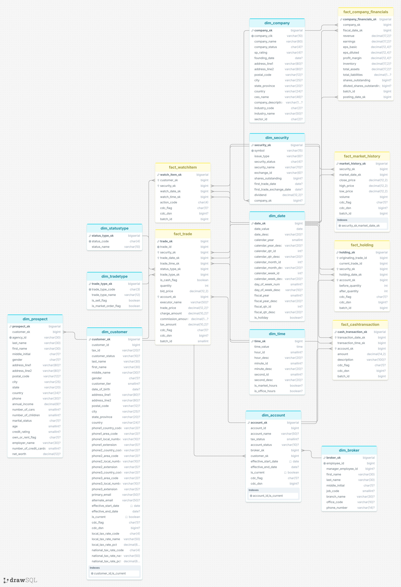

# Data Lineage — Brokerage Data Platform 
## Table of Contents
1. [Star Schema](#star-schema)
    - [Dimension Tables](#dimension-tables)
    - [Fact Tables](#fact-tables)
    - [Tables Intentionally Not Modeled](#tables-intentionally-not-modeled)
2. [Architecture Decision Record](#architecture-decision-record)
    - [ADR-001: Outrigger dimensions instead of Centipede Fact Tables or full snowflaking](#adr-001-outrigger-dimensions-instead-of-centipede-fact-tables-or-full-snowflaking)
    - [ADR-002: Denormalize Industry into `dim_company` (not a separate outrigger)](#adr-002-denormalize-industry-into-dim_company-not-a-separate-outrigger)
    - [ADR-003: Denormalize Tax Rate into `dim_customer` (not a separate outrigger)](#adr-003-denormalize-tax-rate-into-dim_customer-not-a-separate-outrigger)
    - [ADR-004: `fact_company_financials` as a periodic snapshot fact, not a reference table](#adr-004-fact_company_financials-as-a-periodic-snapshot-fact-not-a-reference-table)
    - [ADR-005: `batch_id` on every fact table](#adr-005-batch_id-on-every-fact-table)
    - [ADR-006: Derived FKs on `fact_holding` instead of a fact-to-fact join](#adr-006-derived-fks-on-fact_holding-instead-of-a-fact-to-fact-join)
    - [ADR-007: `HH_H_T_ID`/`HH_T_ID` kept as degenerate dimensions, not a modeled 1:1 relationship](#adr-007-hh_h_t_idhh_t_id-kept-as-degenerate-dimensions-not-a-modeled-11-relationship)
    - [ADR-008: Type 2 SCD on `dim_customer` and `dim_account`](#adr-008-type-2-scd-on-dim_customer-and-dim_account)
    - [ADR-009: Universal Surrogate Keys across All Tables (Preserving Natural Key on fact_trade)](#adr-009-universal-surrogate-keys-across-all-tables-preserving-natural-key-on-fact_trade)   

Source: TPC Benchmark™ DI Standard Specification, Rev 1.1.0
Target: ClickHouse schema `gold`

Legend: **PK** = surrogate primary key · **NK** = natural/business key from source · **FK** = foreign key to another dimension · **Derived** = value computed/looked up during ETL, not copied directly from a source column

## Star Schema Diagram

---

## Dimension Tables

### dim_date
| Source | Scope |
|---|---|
| `Date.txt` | Batch1 only |

| Target column | Source column | Notes |
|---|---|---|
| date_sk (PK) | SK_DateID | |
| date_value | DateValue | |
| date_desc | DateDesc | |
| calendar_year_id | CalendarYearID | |
| calendar_year_desc | CalendarYearDesc | |
| calendar_quarter_id | CalendarQtrID | |
| calendar_quarter_desc | CalendarQtrDesc | |
| calendar_month_id | CalendarMonthID | |
| calendar_month_desc | CalendarMonthDesc | |
| calendar_week_id | CalendarWeekID | |
| calendar_week_desc | CalendarWeekDesc | |
| day_of_week_num | DayOfWeekNum | |
| day_of_week_desc | DayOfWeekDesc | |
| fiscal_year_id | FiscalYearID | |
| fiscal_year_desc | FiscalYearDesc | |
| fiscal_quarter_id | FiscalQtrID | |
| fiscal_quarter_desc | FiscalQtrDesc | |
| is_holiday | HolidayFlag | |

**Load pattern:** one-time load, Batch1 only. Conformed dimension referenced by every fact table.

---

### dim_time
| Source | Scope |
|---|---|
| `Time.txt` | Batch1 only |

| Target column | Source column | Notes |
|---|---|---|
| time_sk (PK) | SK_TimeID | |
| time_value | TimeValue | |
| hour_id | HourID | |
| hour_desc | HourDesc | |
| minute_id | MinuteID | |
| minute_desc | MinuteDesc | |
| second_id | SecondID | |
| second_desc | SecondDesc | |
| is_market_hours | MarketHoursFlag | |
| is_office_hours | OfficeHoursFlag | |

**Load pattern:** one-time load, Batch1 only. Referenced by facts with intraday timestamps only (`fact_trade`, `fact_cashtransaction`, `fact_watchitem`) — not `fact_market_history` (date-only source) or `fact_company_financials` (quarter grain).

---

### dim_statustype
| Source | Scope |
|---|---|
| `StatusType.txt` | Batch1 only |

| Target column | Source column | Notes |
|---|---|---|
| status_type_sk (PK) | — | Generated surrogate key |
| status_code (NK) | ST_ID | |
| status_name | ST_NAME | |

**Load pattern:** static reference load, Batch1 only. Directly joined to `fact_trade` (`T_ST_ID`).

---

### dim_tradetype
| Source | Scope |
|---|---|
| `TradeType.txt` | Batch1 only |

| Target column | Source column | Notes |
|---|---|---|
| trade_type_sk (PK) | — | Generated surrogate key |
| trade_type_code (NK) | TT_ID | |
| trade_type_name | TT_NAME | |
| is_sell | TT_IS_SELL | |
| is_market_order | TT_IS_MRKT | |

**Load pattern:** static reference load, Batch1 only. Directly joined to `fact_trade` (`T_TT_ID`).

---

### dim_broker
| Source | Scope |
|---|---|
| `HR.csv` | Batch1 only |

| Target column | Source column | Notes |
|---|---|---|
| broker_sk (PK) | — | Generated surrogate key |
| employee_id (NK) | EmployeeID | |
| manager_id | ManagerID | |
| first_name | EmployeeFirstName | |
| last_name | EmployeeLastName | |
| middle_initial | EmployeeMI | |
| job_code | EmployeeJobCode | |
| branch_name | EmployeeBranch | |
| office_code | EmployeeOffice | |
| phone_number | EmployeePhone | |

**Load pattern:** static load, Batch1 only. Joined via `dim_account.broker_sk` (from `CA_B_ID`); not joined directly to any fact table.

---

### dim_company
| Source | Scope |
|---|---|
| `FINWIRE` — `CMP` records | Batch1 only |
| `Industry.txt` (denormalized in) | Batch1 only |

| Target column | Source column | Notes |
|---|---|---|
| company_sk (PK) | — | Generated surrogate key |
| cik (NK) | CIK | |
| company_name | CompanyName | |
| status | Status | |
| industry_code | IndustryID | Join key used at ETL time to pull industry_name/sector_id below |
| industry_name | Industry.txt: IN_NAME | **Derived** — denormalized via `IndustryID = IN_ID` lookup instead of a separate `dim_industry` outrigger |
| sector_id | Industry.txt: IN_SC_ID | **Derived**, same lookup as above |
| sp_rating | SPrating | |
| founding_date | FoundingDate | |
| address_line1 | AddrLine1 | |
| address_line2 | AddrLine2 | |
| postal_code | PostalCode | |
| city | City | |
| state_province | StateProvince | |
| country | Country | |
| ceo_name | CEOname | |
| description | Description | |

**Load pattern:** static load, Batch1 only (FINWIRE is quarterly but company master attributes loaded once per company). Reached only via `dim_security.company_sk` — no fact table joins directly to `dim_company` except `fact_company_financials`.

---

### dim_security
| Source | Scope |
|---|---|
| `FINWIRE` — `SEC` records | Batch1 only |

| Target column | Source column | Notes |
|---|---|---|
| security_sk (PK) | — | Generated surrogate key |
| symbol (NK) | Symbol | |
| issue_type | IssueType | |
| status | Status | |
| security_name | Name | |
| exchange_id | ExID | |
| shares_outstanding | ShOut | |
| first_trade_date | FirstTradeDate | |
| first_trade_exchange_date | FirstTradeExchg | |
| dividend | Dividend | |
| company_sk (FK) | CoNameOrCIK | **Derived** — resolved to `dim_company.company_sk` by matching on company name (if non-numeric) or CIK (if all-digits), per spec's dual-mode field |

**Load pattern:** static load, Batch1 only. Joined directly by `fact_trade`, `fact_holding`, `fact_market_history`, `fact_watchitem`.

---

### dim_customer
| Source | Scope |
|---|---|
| `CustomerMgmt.xml` | Batch1 only |
| `Customer.txt` | Batch2/3 only |

| Target column | Source column | Notes |
|---|---|---|
| customer_sk (PK) | — | Generated surrogate key |
| customer_id (NK) | C_ID | |
| tax_id | C_TAX_ID | |
| status_code | C_ST_ID | Batch2/3 only — not present in `CustomerMgmt.xml` |
| last_name | C_L_NAME | Batch1: not directly present, derived from XML `Customer` element if modeled; Batch2/3: direct |
| first_name | C_F_NAME | |
| middle_name | C_M_NAME | |
| gender | C_GNDR | |
| tier | C_TIER | |
| date_of_birth | C_DOB | |
| address_line1 | C_ADLINE1 | Batch2/3 only |
| address_line2 | C_ADLINE2 | Batch2/3 only |
| postal_code | C_ZIPCODE | Batch2/3 only |
| city | C_CITY | Batch2/3 only |
| state_province | C_STATE_PROV | Batch2/3 only |
| country | C_CTRY | Batch2/3 only |
| phone1_country_code ... phone3_extension | C_CTRY_1...C_EXT_3 | Batch2/3 only. `CustomerMgmt.xml` has no phone fields in the XSD provided |
| primary_email | C_PRIM_EMAIL | Batch2/3 only |
| alternate_email | C_ALT_EMAIL | Batch2/3 only |
| local_tax_rate_sk (FK) | C_LCL_TX_ID | **Derived** — resolved to `dim_taxrate.tax_rate_sk`; source: `TaxInfo/C_LCL_TX_ID` (Batch1) or `C_LCL_TX_ID` (Batch2/3) |
| national_tax_rate_sk (FK) | C_NAT_TX_ID | **Derived**, same pattern |
| effective_start_date | — | **Derived** — ETL-assigned (Type 2 SCD tracking column) |
| effective_end_date | — | **Derived** — ETL-assigned, NULL while current |
| is_current | — | **Derived** — ETL-assigned, TRUE for the active version of the row |
| local_tax_rate_code | — | **Derived** — denormalized from `dim_taxrate.tax_rate_code` for convenience; not a foreign key |
| local_tax_rate_name | — | **Derived** — denormalized from `dim_taxrate.tax_rate_name` for convenience; not a foreign key |
| local_tax_rate_pct | — | **Derived** — denormalized from `dim_taxrate.tax_rate_pct` for convenience; not a foreign key |
| national_tax_rate_code | — | **Derived** — denormalized from `dim_taxrate.tax_rate_code` for convenience; not a foreign key |
| national_tax_rate_name | — | **Derived** — denormalized from `dim_taxrate.tax_rate_name` for convenience; not a foreign key |
| national_tax_rate_pct | — | **Derived** — denormalized from `dim_taxrate.tax_rate_pct` for convenience; not a foreign key |

**Load pattern:** Batch1 historical load, then CDC inserts/updates in Batch2/3 (`CDC_FLAG`). Modeled as **Type 2 SCD** since customer attributes change over time and CDC explicitly tracks inserts vs. updates — history is preserved by expiring the prior row and inserting a new version rather than overwriting in place.

---

### dim_account
| Source | Scope |
|---|---|
| `CustomerMgmt.xml` — `Account` elements | Batch1 only |
| `Account.txt` | Batch2/3 only |

| Target column | Source column | Notes |
|---|---|---|
| account_sk (PK) | — | Generated surrogate key |
| account_id (NK) | CA_ID | |
| broker_sk (FK) | CA_B_ID | **Derived** — resolved to `dim_broker.broker_sk` |
| customer_sk (FK) | CA_C_ID | **Derived** — resolved to `dim_customer.customer_sk`; Batch1 source is the parent `Customer/C_ID` in the XML, not a flat `CA_C_ID` field |
| account_name | CA_NAME | |
| tax_status | CA_TAX_ST | |
| status_code | CA_ST_ID | Batch2/3 only — not present in `CustomerMgmt.xml` |
| effective_start_date | — | **Derived** — ETL-assigned (Type 2 SCD tracking column) |
| effective_end_date | — | **Derived** — ETL-assigned, NULL while current |
| is_current | — | **Derived** — ETL-assigned |

**Load pattern:** Batch1 historical load, then CDC inserts/updates in Batch2/3. Modeled as **Type 2 SCD**, same rationale as `dim_customer`.

---

### dim_prospect
| Source | Scope |
|---|---|
| `Prospect.csv` | Batch1 & Batch2/3 (full re-extract every batch — no CDC) |

| Target column | Source column | Notes |
|---|---|---|
| prospect_sk (PK) | — | Generated surrogate key |
| agency_id (NK) | AgencyID | |
| last_name | LastName | |
| first_name | FirstName | |
| middle_initial | MiddleInitial | |
| gender | Gender | |
| address_line1 | AddressLine1 | |
| address_line2 | AddressLine2 | |
| postal_code | PostalCode | |
| city | City | |
| state | State | |
| country | Country | |
| phone_number | Phone | |
| annual_income | Income | |
| number_of_cars | NumberCars | |
| number_of_children | NumberChildren | |
| marital_status | MaritalStatus | |
| age | Age | |
| credit_rating | CreditRating | |
| own_or_rent_flag | OwnOrRentFlag | |
| employer_name | Employer | |
| number_of_credit_cards | NumberCreditCards | |
| net_worth | NetWorth | |
| matched_customer_sk (FK) | — | **Derived** — ETL-assigned when a prospect converts to a customer (business-key match); navigation-only link, never used in analytical fact joins |
| batch_id | — | **Derived** — ETL-assigned, tracks which batch's full re-extract this row belongs to |

**Load pattern:** full re-extract on every batch (no CDC in source). No fact table references this dimension directly — it exists for master-data navigation only.

---

## Fact Tables

### fact_trade
| Source | Scope |
|---|---|
| `Trade.txt` | Batch1 (14 fields, no CDC) & Batch2/3 (16 fields, with CDC) |

| Target column | Source column | Notes |
|---|---|---|
| trade_sk (PK) | — | Generated surrogate key |
| trade_id | T_ID | Degenerate dimension |
| trade_date_sk (FK) | T_DTS | **Derived** — date component resolved to `dim_date.date_sk` |
| trade_time_sk (FK) | T_DTS | **Derived** — time component resolved to `dim_time.time_sk` |
| status_type_sk (FK) | T_ST_ID | **Derived** — resolved to `dim_statustype.status_type_sk` |
| trade_type_sk (FK) | T_TT_ID | **Derived** — resolved to `dim_tradetype.trade_type_sk` |
| account_sk (FK) | T_CA_ID | **Derived** — resolved to `dim_account.account_sk` |
| security_sk (FK) | T_S_SYMB | **Derived** — resolved to `dim_security.security_sk` |
| is_cash | T_IS_CASH | |
| quantity | T_QTY | |
| bid_price | T_BID_PRICE | |
| executed_by_name | T_EXEC_NAME | |
| trade_price | T_TRADE_PRICE | NULL unless status = CMPT |
| fee_amount | T_CHRG | |
| commission_amount | T_COMM | |
| tax_amount | T_TAX | |
| cdc_flag | CDC_FLAG | NULL for Batch1 rows (field absent in Historical Load) |
| cdc_dsn | CDC_DSN | NULL for Batch1 rows |
| source_batch_id | — | **Derived** — ETL-assigned batch identifier |

**Grain:** one row per trade event.

---

### fact_holding
| Source | Scope |
|---|---|
| `HoldingHistory.txt` | Batch1 (4 fields, no CDC) & Batch2/3 (6 fields, with CDC) |

| Target column | Source column | Notes |
|---|---|---|
| holding_sk (PK) | — | Generated surrogate key |
| originating_trade_id | HH_H_T_ID | Degenerate dimension; trade that originally created this holding position |
| current_trade_id | HH_T_ID | Degenerate dimension; trade that produced this specific row |
| holding_date_sk (FK) | — | **Fully derived** — not a source column; resolved by looking up `T_DTS` on `fact_trade` where `T_ID = HH_T_ID`, then mapping to `dim_date.date_sk` |
| account_sk (FK) | — | **Fully derived** — not a source column; resolved by looking up `T_CA_ID` on `fact_trade` where `T_ID = HH_T_ID`, then mapping to `dim_account.account_sk` |
| security_sk (FK) | — | **Fully derived** — not a source column; resolved by looking up `T_S_SYMB` on `fact_trade` where `T_ID = HH_T_ID`, then mapping to `dim_security.security_sk` |
| quantity_before | HH_BEFORE_QTY | |
| quantity_after | HH_AFTER_QTY | |
| cdc_flag | CDC_FLAG | NULL for Batch1 rows |
| cdc_dsn | CDC_DSN | NULL for Batch1 rows |
| source_batch_id | — | **Derived** — ETL-assigned batch identifier |
| batch_id | — | **Derived** — ETL-assigned batch identifier, same as `batch_id` |

**Grain:** one row per holding position change. **ETL dependency:** must load after `fact_trade` for the same batch, since `account_sk`/`security_sk`/`holding_date_sk` are resolved via trade lookup rather than copied from the source file.

---

### fact_market_history
| Source | Scope |
|---|---|
| `DailyMarket.txt` | Batch1 (no CDC) & Batch2/3 (with CDC, `CDC_FLAG` always `'I'`) |

| Target column | Source column | Notes |
|---|---|---|
| market_history_sk (PK) | — | Generated surrogate key |
| market_date_sk (FK) | DM_DATE | **Derived** — resolved to `dim_date.date_sk` |
| security_sk (FK) | DM_S_SYMB | **Derived** — resolved to `dim_security.security_sk` |
| close_price | DM_CLOSE | |
| high_price | DM_HIGH | |
| low_price | DM_LOW | |
| volume | DM_VOL | |
| cdc_flag | CDC_FLAG | Always `'I'` when present (inserts only, per spec); NULL for Batch1 rows |
| source_batch_id | — | **Derived** — ETL-assigned batch identifier |
| batch_id | — | **Derived** — ETL-assigned batch identifier, same as `batch_id` |

**Grain:** one row per security per trading day. No `dim_time` join — source has no intraday timestamp.

---

### fact_cashtransaction
| Source | Scope |
|---|---|
| `CashTransaction.txt` | Batch1 & Batch2/3 |
| **Note:** not present in the reviewed spec excerpt; layout carried forward from a previously verified real sample — treat as unconfirmed against the official spec text |

| Target column | Source column | Notes |
|---|---|---|
| cash_transaction_sk (PK) | — | Generated surrogate key |
| transaction_date_sk (FK) | CT_DTS | **Derived** — date component resolved to `dim_date.date_sk` |
| transaction_time_sk (FK) | CT_DTS | **Derived** — time component resolved to `dim_time.time_sk` |
| account_sk (FK) | CT_CA_ID | **Derived** — resolved to `dim_account.account_sk` |
| transaction_amount | CT_AMT | Negative = withdrawal |
| transaction_description | CT_NAME | |
| cdc_flag | CDC_FLAG | Incremental batches only |
| cdc_dsn | CDC_DSN | Incremental batches only |
| source_batch_id | — | **Derived** — ETL-assigned batch identifier |
| batch_id | — | **Derived** — ETL-assigned batch identifier, same as `batch_id` |

**Grain:** one row per cash transaction event.

---

### fact_watchitem
| Source | Scope |
|---|---|
| `WatchHistory.txt` | Batch1 (no CDC, ordered by W_DTS) & Batch2/3 (with CDC, ordered by CDC_DSN) |

| Target column | Source column | Notes |
|---|---|---|
| watch_item_sk (PK) | — | Generated surrogate key |
| watch_date_sk (FK) | W_DTS | **Derived** — date component resolved to `dim_date.date_sk` |
| watch_time_sk (FK) | W_DTS | **Derived** — time component resolved to `dim_time.time_sk` |
| customer_sk (FK) | W_C_ID | **Derived** — resolved to `dim_customer.customer_sk` |
| security_sk (FK) | W_S_SYMB | **Derived** — resolved to `dim_security.security_sk` |
| watch_action | W_ACTION | `ACTV` (activate) or `CNCL` (cancel) |
| cdc_flag | CDC_FLAG | Always `'I'` when present — rows are only added, never updated/deleted, per spec; NULL for Batch1 rows |
| cdc_dsn | CDC_DSN | NULL for Batch1 rows |
| source_batch_id | — | **Derived** — ETL-assigned batch identifier |
| batch_id | — | **Derived** — ETL-assigned batch identifier, same as `batch_id` |

**Grain:** one row per watch-list activate/cancel event. No `dim_account` join — source has no account reference.

---

### fact_company_financials
| Source | Scope |
|---|---|
| `FINWIRE` — `FIN` records | Batch1 only, quarterly files |

| Target column | Source column | Notes |
|---|---|---|
| company_financials_sk (PK) | — | Generated surrogate key |
| fiscal_quarter_date_sk (FK) | QtrStartDate | **Derived** — resolved to `dim_date.date_sk` |
| posting_date_sk (FK) | PostingDate | **Derived** — resolved to `dim_date.date_sk` |
| company_sk (FK) | CoNameOrCIK | **Derived** — resolved to `dim_company.company_sk` by matching on company name (if non-numeric) or CIK (if all-digits) |
| fiscal_year | Year | |
| fiscal_quarter | Quarter | |
| revenue | Revenue | |
| earnings | Earnings | |
| eps_basic | EPS | |
| eps_diluted | DilutedEPS | |
| profit_margin | Margin | |
| inventory_value | Inventory | |
| total_assets | Assets | |
| total_liabilities | Liabilities | |
| shares_outstanding | ShOut | |
| diluted_shares_outstanding | DilutedShOut | |
| batch_id | — | **Derived** — ETL-assigned batch identifier, same as `batch_id` |

**Grain:** one row per company per fiscal quarter. This table was previously misclassified as a static reference lookup; corrected to a periodic snapshot fact because it carries time-varying measures at company+quarter grain.

---

## Tables Intentionally Not Modeled

| Source file | Reason |
|---|---|
| `TradeHistory.txt` | Historical Load only, per spec — tracks trade status transitions (`TH_ST_ID` over time) within Batch1. Not modeled as a fact here since it is subsumed by `fact_trade.status_type_sk` at current-state grain; add as `fact_trade_status_history` if full status-transition history is required downstream. |
| `BatchDate.txt` | Control file (single as-of date per batch) — used by the ETL orchestration layer, not part of the analytical model. |
| `*_audit.csv` | ETL/operational audit metrics (row counts, etc.) — used for pipeline monitoring, not part of the analytical model. |

## Architecture Decision Record 
### ADR-001: Outrigger dimensions instead of Centipede Fact Tables or full snowflaking
 
**Context:** `dim_company` (reached via `dim_security`) and `dim_prospect` (reached via `dim_customer`) have no independent grain relationship to any fact table.
 
**Decision:** Model them as **outriggers** — a single controlled hop off their parent dimension, not a direct fact-table FK.
 
**Alternatives considered:**
- **Centipede fact table** (adding `company_sk` and `prospect_sk` as direct FK columns on every relevant fact): rejected. This creates two parallel join paths into the same data (fact → security → company, *and* fact → company directly), which risks fan-out/double-counting and adds FK columns to fact tables for data that's really an attribute of an existing dimension, not the transaction itself.
- **Full snowflaking** (splitting company into company/industry/sector/etc. as a normalized chain): rejected — over-normalizes low-cardinality data and adds join hops with no analytical benefit.
- **Flattening company attributes directly into `dim_security`**: considered viable, rejected only to keep company as a reusable entity (a company can issue multiple securities) rather than duplicating its attributes per security row.
**Consequence:** One join hop is required to reach company or prospect attributes from a fact table. Accepted as a standard, low-cost Kimball pattern — not the same failure mode as snowflaking a dimension's own native attributes.
 
---
 
### ADR-002: Denormalize Industry into `dim_company` (not a separate outrigger)
 
**Context:** `Industry.txt` is a static, 2-column-code lookup (industry code → name, sector).
 
**Decision:** Flatten `industry_name` and `sector_id` directly into `dim_company` at ETL load time, keyed off `industry_code`.
 
**Alternatives considered:**
- **`dim_industry` as its own outrigger table**: rejected. Industry is extremely low-cardinality (dozens of rows), essentially static, and only ever queried in the context of a company. A separate table adds a join hop with no real analytical flexibility gained — industry is never sliced independently of company in this domain.
**Consequence:** If industry taxonomy changes structure significantly in the future, all company rows referencing the old code need a backfill. Accepted given the low likelihood and low blast radius of that scenario.
 
---
 
### ADR-003: Denormalize Tax Rate into `dim_customer` (not a separate outrigger)
 
**Context:** `TaxRate.txt` is a static lookup (tax code → name, rate) referenced twice per customer (local and national jurisdiction).
 
**Decision:** Flatten `local_tax_rate_code/name/pct` and `national_tax_rate_code/name/pct` directly into `dim_customer`.
 
**Alternatives considered:**
- **`dim_taxrate` as a separate outrigger, FK'd twice from `dim_customer`**: this was the original design and remains structurally valid. Switched to denormalization for the same reason as Industry — the table is tiny and static, and a role-playing double-FK outrigger added query complexity (two joins to the same tiny table) without giving analysts anything a flattened column doesn't.
**Consequence:** Same tradeoff as ADR-002 — a change to tax rate values requires updating denormalized copies across customer rows (mitigated by this already being a Type 2 SCD table, so a rate change naturally produces a new customer version).
 
---
 
### ADR-004: `fact_company_financials` as a periodic snapshot fact, not a reference table
 
**Context:** FINWIRE `FIN` records were originally grouped with static reference data (Trade Type, Status Type, etc.) in early drafts.
 
**Decision:** Model as its own fact table at company + fiscal-quarter grain, with FKs to `dim_company`, `dim_date` (fiscal quarter) and `dim_date` (posting date).
 
**Alternatives considered:**
- **Keep as a reference/lookup table**: rejected — it carries genuine time-varying quantitative measures (revenue, earnings, assets), which is fact-table behavior, not lookup-table behavior. Modeling it as a dimension would have made period-over-period financial analysis impossible without workarounds.
**Consequence:** One more fact table to maintain, but correct grain and correct analytical capability (quarter-over-quarter trends, joins to `fact_trade`/`fact_holding` via `company_sk → dim_security → dim_company`).
 
---
 
### ADR-005: `batch_id` on every fact table
 
**Context:** Every fact source (`Trade.txt`, `HoldingHistory.txt`, `CashTransaction.txt`, `WatchHistory.txt`, `DailyMarket.txt`) is loaded across a Batch1 historical load plus Batch2/Batch3 incremental CDC loads, with genuinely different column layouts (CDC fields absent in Batch1).
 
**Decision:** Every fact table carries `batch_id`, populated by the ETL process, independent of the source file's own fields.
 
**Alternatives considered:**
- **Rely on `cdc_dsn`/load timestamp alone to infer batch**: rejected — `cdc_dsn` is NULL for Batch1 rows by design (no CDC in the historical load), so it can't identify which batch a row belongs to on its own.
- **Track batch only in a separate audit/control table**: rejected as the sole mechanism — makes it expensive to reprocess or roll back a specific batch, since you'd need a join out to the control table for every fact row.
**Consequence:** Minor storage overhead per fact row; in exchange, any batch can be isolated, reprocessed, or rolled back with a single-column filter.
 
---
 
### ADR-006: Derived FKs on `fact_holding` instead of a fact-to-fact join
 
**Context:** `HoldingHistory.txt` carries only `HH_H_T_ID`, `HH_T_ID`, before/after quantity — no account, security, or date columns.
 
**Decision:** Resolve `account_sk`, `security_sk`, and `holding_date_sk` during ETL by looking up the associated trade in `fact_trade` (via `HH_T_ID`), and store the resolved surrogate keys directly on `fact_holding`.
 
**Alternatives considered:**
- **Enforce a live fact-to-fact join between `fact_holding` and `fact_trade` at query time**: rejected — Kimball generally avoids direct fact-to-fact joins; they complicate BI tool semantic layers and risk incorrect fan-out if the relationship cardinality isn't perfectly 1:1 (which it isn't — see below).
- **Leave `fact_holding` joined only by `originating_trade_id`/`current_trade_id` as degenerate dimensions, with no account/security FK at all**: rejected — would force every "holdings by account" or "holdings by security" query through a manual trade lookup, defeating the purpose of a dimensional model.
**Consequence:** `fact_holding` must load after `fact_trade` within the same batch (ETL ordering dependency), since the lookup depends on the trade already being present.
 
---
 
### ADR-007: `HH_H_T_ID`/`HH_T_ID` kept as degenerate dimensions, not a modeled 1:1 relationship
 
**Context:** Initial design assumed `fact_trade` ↔ `fact_holding` was 1:1 via `HH_H_T_ID`.
 
**Decision:** Both `originating_trade_id` and `current_trade_id` are stored as plain degenerate-dimension columns (informational, not enforced FKs with a declared cardinality).
 
**Alternatives considered:**
- **Enforce 1:1 via `HH_H_T_ID`**: rejected — a single originating trade can be referenced by many subsequent holding rows as a position is modified over time (1:M in practice).
- **Enforce 1:1 via `HH_T_ID`**: also rejected as a hard rule — a single sell trade can close out multiple original lots at once (lot-splitting), producing more than one holding row per triggering trade in that case.
**Consequence:** No declared cardinality constraint between the two facts; documented as "informational lineage, not a guaranteed 1:1 join" so no downstream query assumes uniqueness that the data doesn't guarantee.
 
---
 
### ADR-008: Type 2 SCD on `dim_customer` and `dim_account`
 
**Context:** Both sources are explicitly CDC-tracked (`CDC_FLAG` = Insert/Update) from Batch2/3 onward.
 
**Decision:** Model both as Type 2 SCDs — `effective_start_date`, `effective_end_date`, `is_current`, with a new row inserted (not an in-place update) whenever an update CDC record arrives.
 
**Alternatives considered:**
- **Type 1 (overwrite in place)**: rejected — the source data explicitly distinguishes inserts from updates, signaling that history matters (e.g., "what tier was this customer at the time of this trade" is a valid, expected query in a brokerage analytics context).
**Consequence:** Every fact table joining to `dim_customer`/`dim_account` must resolve the surrogate key that was current *at the time of the transaction*, not the latest one — an ETL responsibility, not a schema-level guarantee.
 
---
 
### ADR-009: Universal Surrogate Keys across All Tables (Preserving Natural Key on fact_trade)

**Context:** T_ID is documented in the TPC-DI specification as a genuinely unique trade identifier. Historically, business keys are sometimes considered for fact table primary keys when they are guaranteed unique.

**Decision:** Implement generated surrogate keys (sk) as the primary key for all tables in the data warehouse, including fact_trade (trade_sk). The source business key (trade_id) is preserved on fact_trade solely as a degenerate-dimension column to serve as a lineage and join target for fact_holding.

**Alternatives considered:**

-  Use business keys (like trade_id) as primary keys where unique: Rejected. Relying on business keys in some tables while using surrogate keys in others breaks architectural uniformity. Enforcing a global surrogate key strategy across all dimensions and fact tables eliminates the risk of future join bugs, insulates the warehouse from changes in source systems, and standardizes ETL pipeline generation.

**Consequence:** A minor storage overhead of one extra column on fact_trade. In return, the entire model achieves absolute architectural consistency by using surrogate keys everywhere, while the business key remains available as a stable, human-readable reference for tracking lineages and performing lookups.